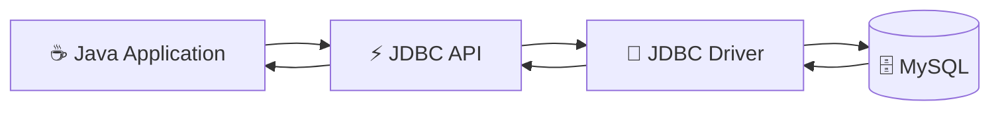
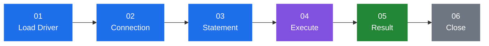
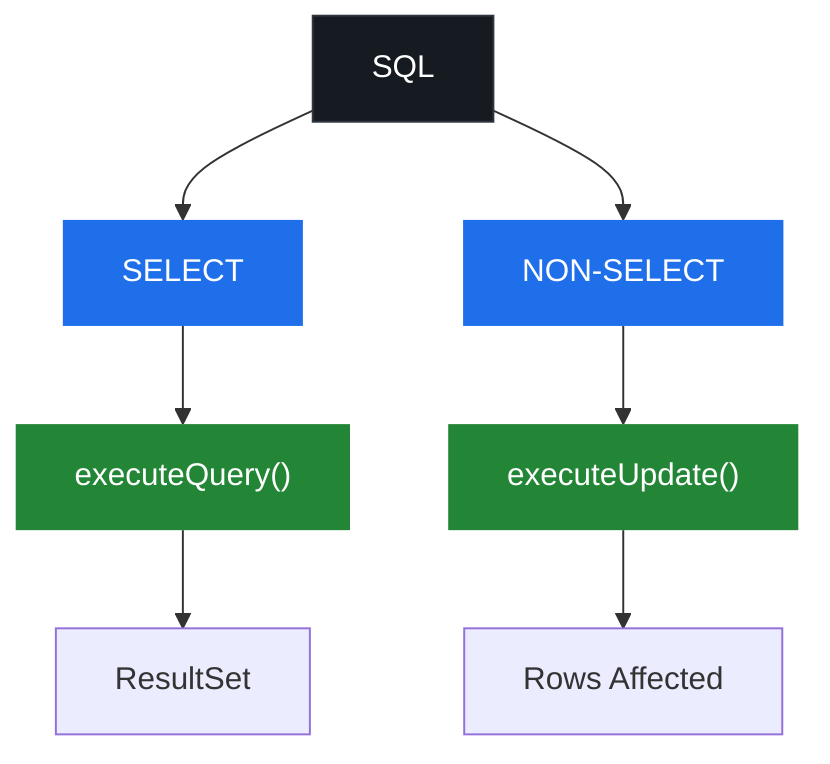
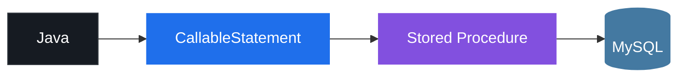
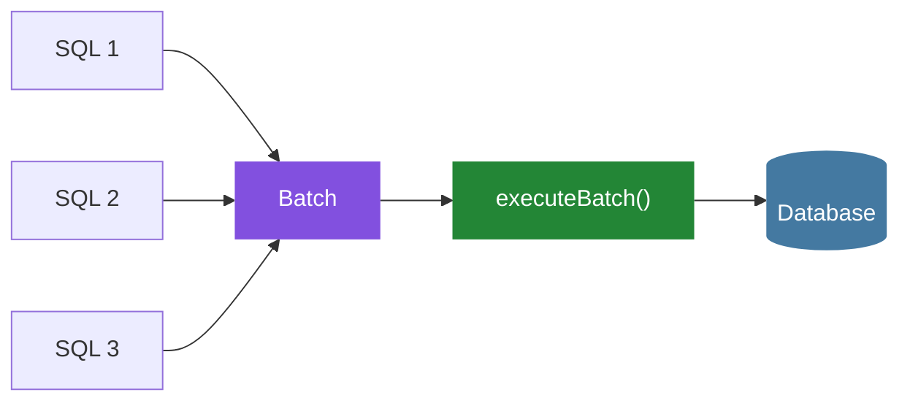
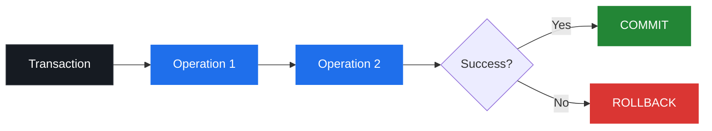
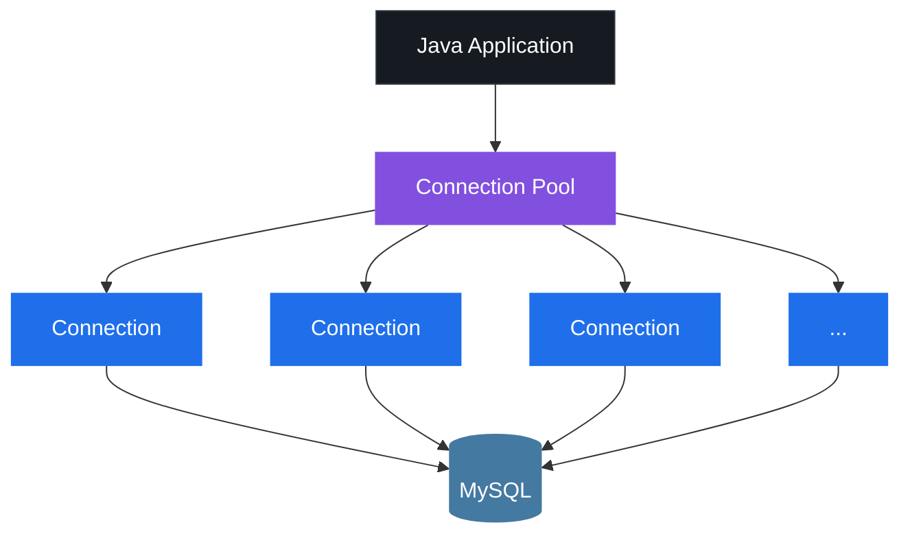
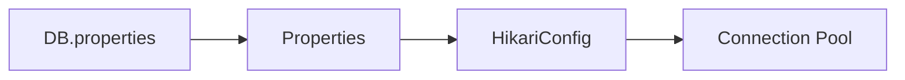
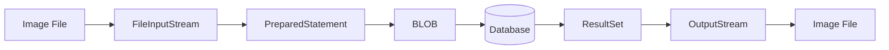
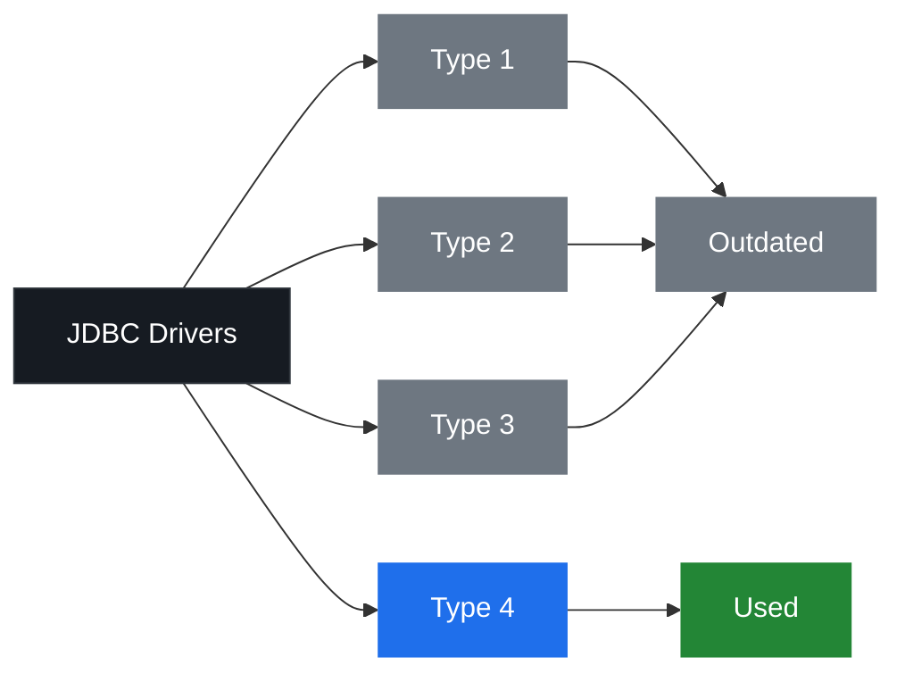

<p align="center">
  
</p>

<p align="center">
  
</p>

<p align="center">
  
  
  
  
</p>

<p align="center">
  
</p>

## 📚 Table of Contents

1. [Overview](#-jdbc)
2. [JDBC API](#-jdbc-api)
3. [JDBC Flow](#-jdbc-flow)
4. [SQL Operations](#️-sql-operations)
5. [ResultSet](#-resultset)
6. [PreparedStatement](#️-preparedstatement)
7. [CallableStatement](#-callablestatement)
8. [Batch Operations](#️-batch-operations)
9. [Transactions](#-transactions)
10. [Connection Pooling](#-connection-pooling)
11. [Database Configuration](#️-database-configuration)
12. [BLOB Handling](#️-blob)
13. [RowSet](#-rowset)
14. [Exception Handling](#-exception-handling)
15. [DatabaseMetaData](#️-databasemetadata)
16. [JDBC Drivers](#-jdbc-drivers)

<p align="center">
  
</p>

## ⚡ JDBC

JDBC provides the API required for a Java application to communicate with a relational database. It sits between the application and the database driver, translating Java calls into database-specific operations.



<p align="center">
  
</p>

## 🧩 JDBC API

```mermaid
mindmap
  root((JDBC))
    Driver
    Connection
    Statement
    PreparedStatement
    CallableStatement
    ResultSet
    RowSet
    DriverManager
    DatabaseMetaData
    SQLException
```

| Component | Purpose |
|---|---|
| `DriverManager` | Locates and loads the correct JDBC driver, manages `Connection` creation |
| `Connection` | Represents a live session with the database |
| `Statement` | Executes static SQL with no parameters |
| `PreparedStatement` | Executes parameterized, precompiled SQL |
| `CallableStatement` | Executes stored procedures |
| `ResultSet` | Represents the tabular result of a query |
| `RowSet` | A connected/disconnected wrapper around `ResultSet` |
| `SQLException` | Thrown for any database access error |

<p align="center">
  
</p>

## 🔄 JDBC Flow



The driver registers itself automatically, a `Connection` is opened, a `Statement` is prepared and executed, results are read, and every resource is closed in reverse order.

<p align="center">
  
</p>

## 🗃️ SQL Operations



| Method | Used For | Returns |
|---|---|---|
| `executeQuery()` | `SELECT` | `ResultSet` |
| `executeUpdate()` | `INSERT` / `UPDATE` / `DELETE` / DDL | `int` (rows affected) |
| `execute()` | SQL of unknown type | `boolean` |

<p align="center">
  
</p>

## 📊 ResultSet

```text
Before First
     │
     ▼
 ┌───────┬────────┬────────┬────────┐
 │ Row 1 │ Row 2  │ Row 3  │ Row 4  │
 └───────┴────────┴────────┴────────┘
     ▲
     │
   Cursor
```

**Navigation:** `next()` · `previous()` · `first()` · `last()` · `absolute(n)`

| Type | Behavior |
|---|---|
| `TYPE_FORWARD_ONLY` | Cursor moves forward only |
| `TYPE_SCROLL_INSENSITIVE` | Scrollable, static snapshot |
| `TYPE_SCROLL_SENSITIVE` | Scrollable, reflects live changes |

| Concurrency | Behavior |
|---|---|
| `CONCUR_READ_ONLY` | Cannot update through the `ResultSet` |
| `CONCUR_UPDATABLE` | Can update through the `ResultSet` |

<p align="center">
  
</p>

## 🛡️ PreparedStatement

Parameterized SQL using `?` placeholders, precompiled by the database for reuse and protection against SQL injection.

| | `Statement` | `PreparedStatement` |
|---|---|---|
| Compilation | Every execution | Once, reused |
| Parameters | String concatenation | Bound via `set*()` |
| Injection risk | High | Protected |

<p align="center">
  
</p>

## 📞 CallableStatement

Used for executing stored procedures.



**Parameter modes:** `IN` · `OUT` · `INOUT`

<p align="center">
  
</p>

## ⚙️ Batch Operations

Multiple SQL operations grouped and executed together, reducing round trips to the database.



<p align="center">
  
</p>

## 🔐 Transactions



**ACID:** Atomicity · Consistency · Isolation · Durability

**Savepoints** let a rollback undo part of a transaction without discarding the whole thing.

**Isolation levels:** `READ_UNCOMMITTED` · `READ_COMMITTED` · `REPEATABLE_READ` · `SERIALIZABLE`

<p align="center">
  
</p>

## 🏊 Connection Pooling

Keeps reusable database connections warm and ready, avoiding the overhead of opening a new connection per request.



**HikariCP** — a lightweight, high-performance pool that manages a fixed set of connections.

<p align="center">
  
</p>

## ⚙️ Database Configuration

Database properties live in a separate configuration file, keeping credentials out of source code.



> ⚠️ Keep credentials out of version control.

<p align="center">
  
</p>

## 🖼️ BLOB

Storing and retrieving binary data (e.g. images) using database `BLOB` columns.



<p align="center">
  
</p>

## 📦 RowSet

`JdbcRowSet` wraps a `ResultSet` as a JavaBean, supporting both connected and disconnected use.

<p align="center">
  
</p>

## ⚠️ Exception Handling

Database operations throw a checked `SQLException`, carrying an error code, `SQLState`, and — for batch operations — a chain of underlying exceptions. `try-with-resources` ensures everything closes even on failure.

<p align="center">
  
</p>

## 🗂️ DatabaseMetaData

Introspects the database itself — driver name and version, supported features, and the schema's tables and columns.

<p align="center">
  
</p>

## 🚗 JDBC Drivers



| Type | Name | Notes |
|---|---|---|
| 1 | JDBC-ODBC Bridge | Outdated |
| 2 | Native-API | Platform-dependent |
| 3 | Network Protocol | Rarely used |
| 4 | Thin Driver | Pure Java — used here |

<p align="center">
  
</p>

<p align="center">
  
</p>
